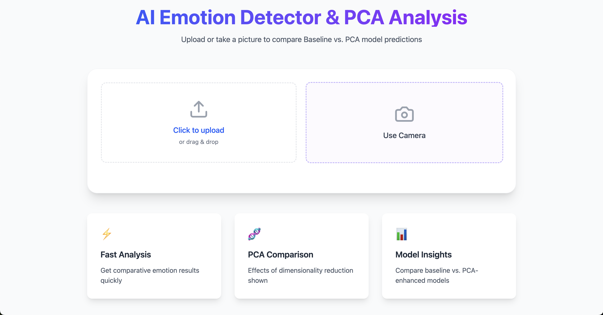
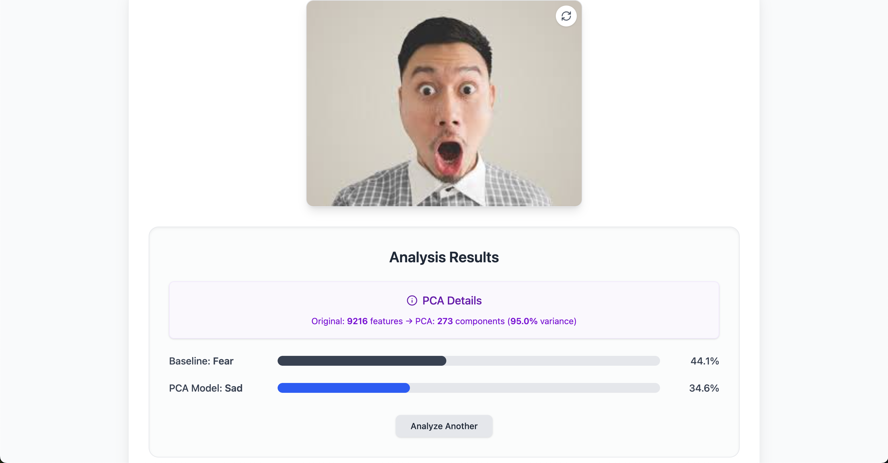

# AI Emotion Detector & PCA Analysis UI

A web application demonstrating facial emotion recognition. It compares a baseline LightGBM model against a LightGBM model trained on PCA-reduced features, showcasing dimensionality reduction impact. Built with React (TypeScript) and Flask.

## Screenshots

**Input / Camera View:**

**Analysis Results:**

_Description:_ The results screen clearly presents the outcome after analyzing an image. It details the PCA transformation (e.g., reducing 9216 original features down to 273 principal components while retaining 95.0% of the variance). It then directly compares the predicted emotion and confidence score from the Baseline model (e.g., Fear at 44.1%) against the prediction from the PCA-optimized model (e.g., Sad at 34.6%), allowing users to see the impact of PCA on this specific prediction.

## Features

- Image Upload & Camera Capture
- Emotion Prediction using Baseline LightGBM Model (with confidence)
- Emotion Prediction using PCA-reduced LightGBM Model (with confidence)
- Display of PCA Transformation Details (features reduced, variance retained)
- Responsive UI with Tailwind CSS & Framer Motion

## Technology Stack

- **Frontend:** React, TypeScript, Tailwind CSS, Framer Motion, Axios
- **Backend:** Python, Flask, LightGBM, Scikit-learn (PCA, Scaler), Joblib, OpenCV, Pillow

## Mathematical Background (Eigenvalues/Eigenvectors)

The Principal Component Analysis (PCA) technique used in this project relies on eigenvalue decomposition. A detailed, step-by-step explanation of how eigenvalues and eigenvectors are calculated from scratch, including the characteristic equation, can be found in the supplementary document:

**[PCA Task - Appendix A: Eigenvalue and Eigenvector Calculation](https://docs.google.com/document/d/1FKm6LOXnHRu5u7a3XQHC1fWEVHBqc5SCcsHtydrn8UY/edit?usp=sharing)**

## Setup & Running

**Prerequisites:**

- Python (3.8+), Pip
- Node.js, npm (or yarn)
- (macOS) Homebrew & `libomp` (`brew install libomp`)

**1. Backend Setup:**

1.  Navigate to the `backend` directory.
2.  Place the required `.joblib` files (baseline model, pca model, scaler, pca transformer) in this directory.
3.  Create/activate a Python virtual environment (e.g., `python/python3 -m venv venv -m venv venv`, `source venv/bin/activate`).
4.  Install dependencies: `pip install -r requirements.txt`
5.  Run the server: `python app.py` (Keep running)

**2. Frontend Setup:**

1.  Navigate to the `frontend` directory.
2.  Install dependencies: `npm install` (or `yarn install`)
3.  Run the development server: `npm run dev`
4.  Access the application in your browser (usually `http://localhost:5173`).

4:\*\* Upload or capture an image via the UI, click "Analyze Emotion", and. Access in browser (e.g., `http://localhost:3000` or `http view the comparative predictions and PCA details.) and see the output

## License

MIT License
